<!-- Please do not change this html logo with link -->

# SPI-RS485 Bridge: Modbus Host Emulation using PIC16F15244 Microcontroller

The RS485 communication with Modbus protocol is mostly used in the industrial sector for its highlighting features, such as balanced line communication, multi-drop facility, good noise immunity and maximum data transmission speed. The Modbus protocol with RS485 physical line makes multi-client transactions easy and error free.

The serial protocol-based clients can be integrated to an RS485 based host system using an SPI-RS485 bridge.

The PIC16F152xx family of microcontrollers (MCUs) is equipped with the Enhanced Universal Synchronous Asynchronous Receiver Transmitter (EUSART), Timers and MSSP peripherals which can be used in RS485 communication and for Serial Peripheral Interface (SPI) implementation to the RS485 bridge system.

This code example highlights the host functionalities. It demonstrates how to get connect to SPI clients to the RS485 network.

## Related Documentation

- [SPI-RS485 Bridge and Modbus Client Implementation using PIC16F15276 Microcontroller](https://github.com/microchip-pic-avr-examples/pic16f15276-cnano-spi-rs485-bridge-modbus-client-mplab-mcc.git)
- [PIC16F152xx Product Family Page](https://www.microchip.com/en-us/products/microcontrollers-and-microprocessors/8-bit-mcus/pic-mcus/pic16f15244)
- [PIC16F152xx Family Code Examples on GitHub](https://github.com/microchip-pic-avr-examples?q=pic16f152&type=&language=&sort=)
- [PIC16F152xx MCU Family Video](https://www.youtube.com/watch?v=nHLv3Th-o-s)
- [PIC16F15244 Data Sheet](https://ww1.microchip.com/downloads/en/DeviceDoc/PIC16F15213-14-23-24-43-44-Data-Sheet-DS40002195B.pdf)

## Demo Description

The SPI-RS485 bridge example aims to integrate serial protocol (SPI) clients to the RS485 based systems.

This demonstration uses host and client systems. The host sends Modbus RTU query frames to the client to ask for the sensor data. The client receives the Modbus frames and responds to the host with the sensor data, if the received frame is valid.

The host system periodically (every 10s) creates the Modbus RTU frame with the client address, function code and address of the desired data, appending the 2-byte Cyclic Redundancy Check (CRC) to the frame and sending the Modbus query frame for reading the client holding registers.

The PIC16F15244 microcontroller serves as the host and is connected to the RS485 2 click via EUSART. It is used to convert EUSART TTL signals to RS485 standard signals, enabling communication with the RS485 bus network.

The client microcontroller receives the frame from the host and validates the CRC of received frame by calculating the CRC. If the CRC matches, then it validates the address. The client performs the required action as per the requested function code and responds to the host by preparing the response Modbus frame.

The client MCU measures the temperature with a Thermo click and the pressure with a Pressure 5 click, storing the information in the dedicated Flash memory.

The PIC16F15276 microcontroller serves as the client and is connected via SPI to the pressure sensor on the Pressure 5 click and the temperature sensor on the Thermo click. The PIC16F15276 MCU communicates with RS485 2 click using the EUSART protocol. The RS485 2 click is used to interface the SPI sensors to the RS485 bus network.

The figure below shows the SPI-RS485 bridge demo block diagram.

  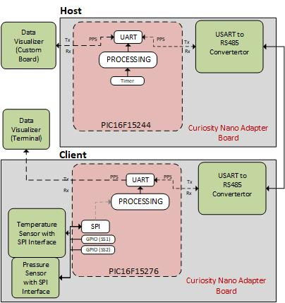
   Figure 1. SPI-RS485 Bridge Block Diagram   

## Modbus Introduction

Modbus is a serial communication protocol developed for usage with Programmable Logic Controllers (PLCs), as a method of transmitting information over serial lines between electronic devices. The device requesting the information is called the Modbus host and the devices supplying information are Modbus clients.

In a standard Modbus network, there is one host and up to 247 clients, each with a unique client address from 1 to 247. The host can also write information to the clients. The host Modbus frame includes the client address, function code, memory address, length of the expected data and CRC.

### Sample Data Frame

Host Modbus RTU Frame

- Client ID
- Function code
- Register address
- Number of registers
- CRC

Client Response Frame

- Client ID
- Function code
- Number of data bytes received
- Register data
- CRC

### Function Code

The second byte sent by the host is the function code. This number tells the client which table to access and whether to read from or write to the table.

### Coil/Register Number

The information is stored in four different tables within the client device. Two tables store on/off discrete values (coils) and two store numerical values (registers). The coils and registers each have a read-only table and read-write table. Each table has 9999 values. Each coil or contact is one bit and assigned a data address between 0x0000 and 0x270E. Each register is one word = sixteen bits = two bytes wide and has a data address between 0x0000 and 0x270E.

### Number of Registers Requested

The total number of registers requested.

### Cyclic Redundancy Check (CRC)

The CRC has two bytes added to the end of every Modbus frame for error detection and identifying data corruption.

Example Frame

|Request Frame Bytes | Description | Response Frame | Description |
|:---------:|:----------:|:-----------:|:---------:|
| 0x15  | Client ID address	| 0x15 | Client ID address |
| 0x03  | Function code	| 0x03 | Function code |
| 0x00  | Address of the requested register (1st byte)	| 0x04 | The Number of data bytes received |
| 0x6B  | Address of the requested register (2nd byte) | 0x00 | Register value High (1st byte) |
| 0x00  | The total number of requested registers (1st byte) | 0x01 | Register value Low (2nd byte) |
| 0x02  | The total number of requested registers (2nd byte) | 0xA1 | Register value High (3rd byte) |
| 0xB6  | CRC for error checking (1st byte)	| 0x9B | Register value Low (4th byte) |
| 0xC3  | CRC for error checking (2nd byte) | 0xC7, 0xC9 | CRC value High and Low (1st and 2nd byte) |

**Note:** Refer [modbus.org](https://modbus.org/) for more details on Modbus.

## Software Used

- [MPLAB® X IDE](http://www.microchip.com/mplab/mplab-x-ide) 6.15.0 or newer
- [MPLAB® XC8 Compiler](http://www.microchip.com/mplab/compilers) 2.45.0 or newer
- [MPLAB® Data Visualizer](https://gallery.microchip.com/packages/AtmelDataVisualizerInstaller-Standalone/) 2.20.674 or newer
- [Microchip PIC16F1xxxx_DFP Device Support](https://packs.download.microchip.com/) 1.20.366 or newer pack
- [MPLAB® Code Configurator (MCC)](https://www.microchip.com/mplab/mplab-code-configurator) 5.3.7 or newer
- TMR0 MCC Melody driver 4.0.11
- ESUART MCC Melody driver 7.1.4
- MSSP MCC Melody driver 6.1.7
- GPIO/Pins drivers MCC Melody driver 3.5.0

## Hardware Used

- [PIC16F15244 Curiosity Nano Board](https://www.microchip.com/en-us/development-tool/ev09z19a)
- [Curiosity Nano Base for Click BoardsTM](https://www.microchip.com/en-us/development-tool/AC164162)
- [RS485 2 Click](https://www.mikroe.com/rs485-2-click)

## Hardware Setup

The PIC16F15244 Curiosity Nano (CNANO) evaluation board with the [RS485 2 click](https://www.mikroe.com/rs485-2-click) is used as host system. The boards are mounted on a Curiosity Nano base for Click boards. The following figure shows hardware setup of the application. Visit [SPI-RS485 Bridge and Modbus Client Implementation using PIC16F15276 Microcontroller](https://github.com/microchip-pic-avr-examples/pic16f15276-cnano-spi-rs485-bridge-modbus-client-mplab-mcc.git) git repository for client hardware setup.

Refer to the hardware connection details table for more information.

  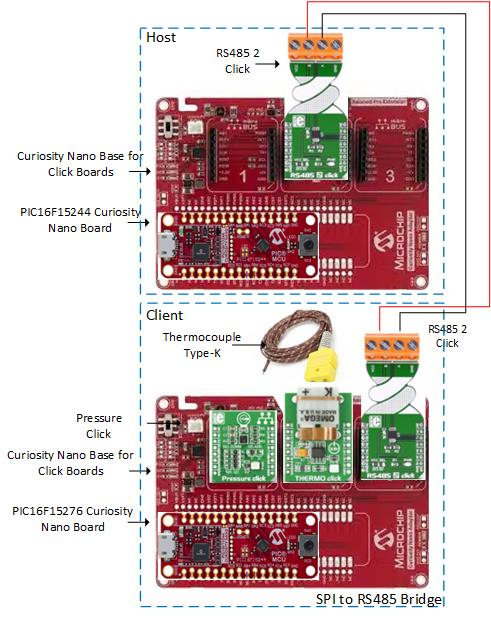
   Figure 2. SPI-RS485 Bridge Hardware Setup   

### Hardware Connection Details

|Sl No. | Microcontroller Pin | Pin Configuration | Signal Name |I/O Pin Direction |
|:---------:|:----------:|:-----------:|:---------:|:------------:|
| 1     | RB5	| TX1	 | Tx Pin for RS485 2 Click	| IN  |
| 2     | RB7	| RX1    | Rx Pin for RS485 2 Click	| OUT  |
| 3     | RC0	| TX     | CDC/Debug TX Line | IN  |
| 4     | RC1	| RX     | CDC/Debug RX Line | OUT  |
| 5     | RA2	| RE     | Receive Control of RS485	| OUT  |
| 6     | RC6	| DE     | Transmit Control of RS485 | OUT |

Visit the [SPI-RS485 Bridge and Modbus Client Implementation using PIC16F15276 Microcontroller](https://github.com/microchip-pic-avr-examples/pic16f15276-cnano-spi-rs485-bridge-modbus-client-mplab-mcc.git) for the hardware connection details of the client system.

**Note:**

1. Connect jumper on the host Curiosity Nano Base For Click Board pins from AN2 (RB5) to TX2.
2. Connect jumper on the host Curiosity Nano Base For Click Board pins from AN1 (RB7) to RX2.
3. Connect jumper on the host Curiosity Nano Base For Click Board pins from SCK (RC6) to CS2.

## Demo Operation

1.	Connect the hardware and prepare the demonstrator setup. Follow the steps in *Hardware Setup* section for hardware setup.
2.  Configure the Data Visualizer for viewing the custom dashboard window. Follow the instructions provided in the *Data Visualizer Configuration section*.
3.	Click the **Serial Port Control Panel Connect** button.
4.	Observe the “Host Modbus RTU Frame No” field, on the first row of the custom board, to understand which frame is sent from host to client.

  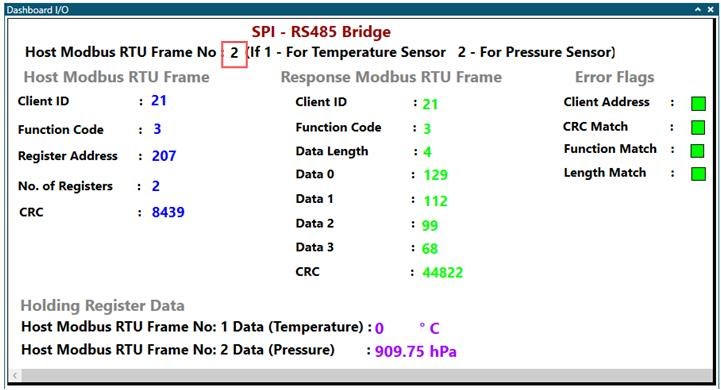
   Figure 3. Frame Type Field in Data Visualizer Custom Dashboard window 

5.	Observe the “Host Modbus RTU Frame” and “Response Modbus RTU Frame” fields to understand the host query frame and client response frame.

  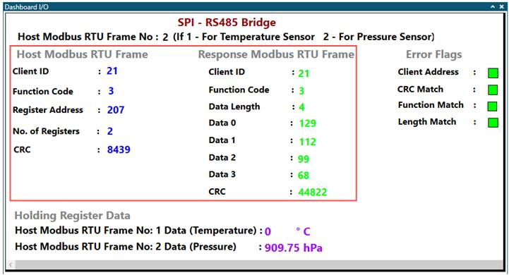
   Figure 4. Modbus RTU Frames in Data Visualizer Custom Dashboard Window 

6.	Observe “Error Flags” fields to identify the errors when the transaction is not successful.

  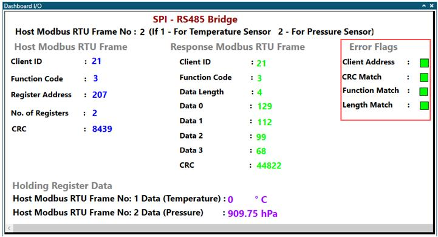
   Figure 5. Error Flags Field in Data Visualizer Custom Dashboard Window 

7.	Observe the temperature and pressure sensor data in the “Holding Register Data” fields for visualizing the measured sensor data received from the client holding registers.

  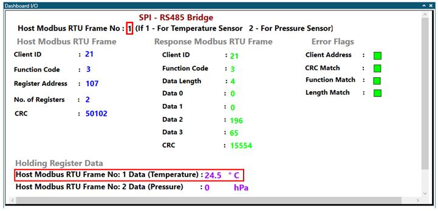
   Figure 6. Figure 6. Temperature Data in Holding Register Data Field in the Data Visualizer Custom Dashboard Window 

  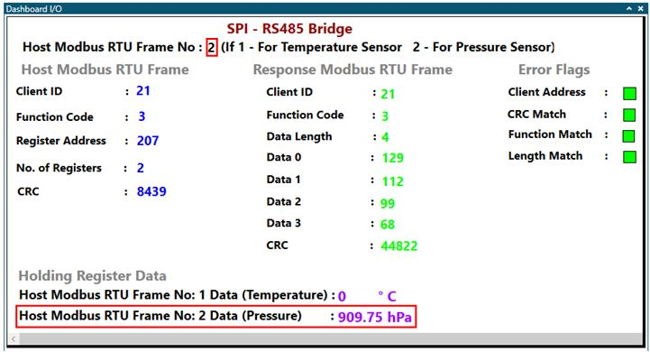
   Figure 7. Pressure Data in Holding Register Data Field in the Data Visualizer Custom Dashboard Window 

## Steps to Configure Data Visualizer

The Data Visualizer tool serves as a graphical user interface during application demonstrations by displaying the host frame and the response received frame from both the host and the client. The preconfigured data streamer file and the custom dashboard file are available in the host firmware package. Follow the steps below to configure the Data Visualizer using the provided files for setup preparation.

### Data Visualizer Serial Port Configuration

1. Open the standalone Data Visualizer. Refer to the [Data Visualizer Software User’s Guide](https://www.microchip.com/DS40001903B) for installation and features.

  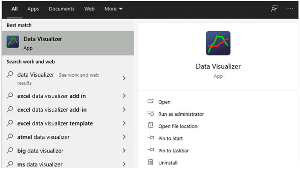
   Figure 8. Standalone Data Visualizer Icon 

2.	In the Data Visualizer window, click the **Configuration** tab.

  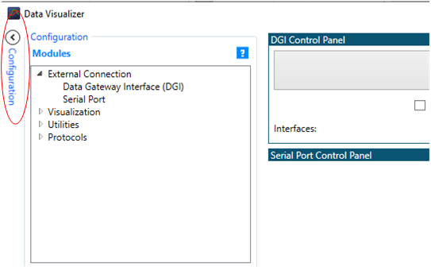
   Figure 9. Data Visualizer Configuration Window 

3.	In the Modules section, expand the External connection option and then double click Serial port.

  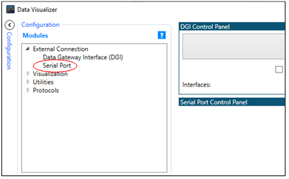
   Figure 10. Data Visualizer Modules Window 

4.	From the Serial Port Control panel, select the Curiosity Virtual Com Port which is connected to the host device.

  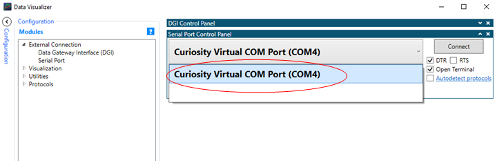
   Figure 11. Data Visualizer Serial Control Panel 

### Data Streamer Configuration

1.	Configure the data streamer for interfacing the dashboard window with the serial port control panel.
2.	To open the Data Stream Control Panel, open the **Configuration** tab located on the left side of the data visualizer tool, expand Protocols, and click the Data Streamer window that appears, as shown in Figure 12.
3.	Click the ‘...’ symbol in the Data Stream Control Panel window and set an appropriate path for the provided data streamer file from the host computer, as shown in Figure 12.

  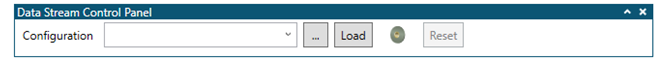
   Figure 12. Data Visualizer Data Streamer Configure Window 

4.	Click the **Load** button in the Data Streamer Control Panel, as shown in Figure 12. The Data Streamer window will load the ports, as shown in Figure 13.

  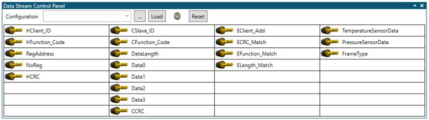
   Figure 13. Data Visualizer Data Streamer Control Panel 

5.	Drag the COM0 output of the Serial Port control panel window and drop it on the Source port of the Data Streamer Control Panel, as shown in Figure 14.

  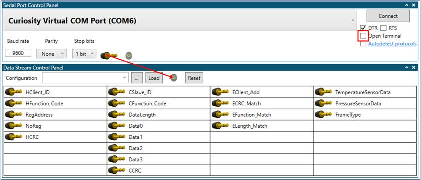
   Figure 14. Connection Between Serial Port and Data Streamer Window 

### Custom Dashboard Configuration

1.	Configure the custom dashboard window to display the temperature and pressure information.
2.	To open the custom dashboard window, open the **Configuration** tab located on the left side of the Data Visualizer tool, expand Visualization, and click Custom Dashboard, as shown in Figure 15.

  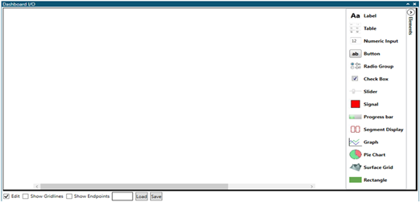
   Figure 15. Custom Dashboard Window 

3.	Check Edit below the dashboard I/O window, click **Load** and set the appropriate path for the provided custom dashboard file from the host computer, as shown in Figure 16.

  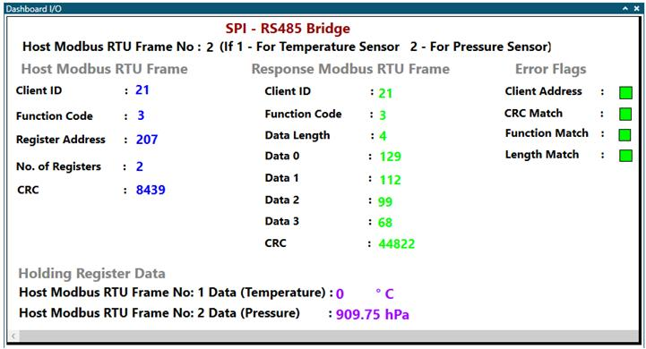
   Figure 16. SPI-RS485 Bridge Custom Dashboard Window 

4.	Check Show Endpoints below the Dashboard I/O window.
5.	Drag the appropriate port pins from the Data Streamer control panel and drop them on the respective endpoints, as shown in the Figure 17.

  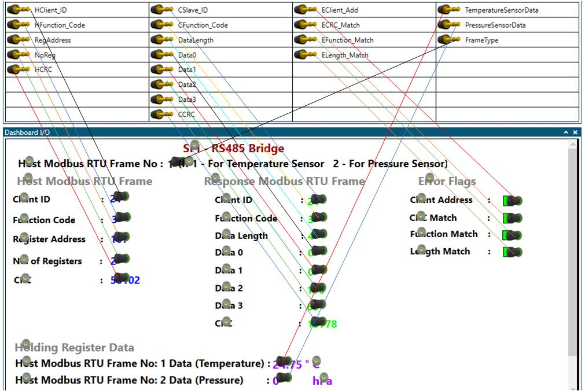
   Figure 17. Data Visualizer Connection Reference Diagram 

6.	Follow the Data Visualizer Serial Configuration steps (1-4) to open the Data Visualizer terminal for the Client system.

  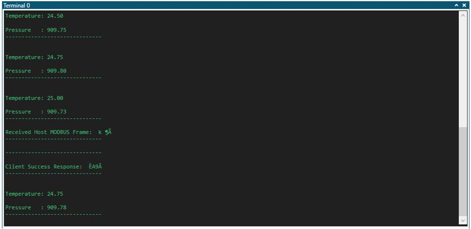
   Figure 18. Data Visualize Terminal Window (Client) 

## Appendix

## Host MCC Configuration

### Clock Module:

- System Clock: 32 MHz
- Clock Source: HFINTOSC

  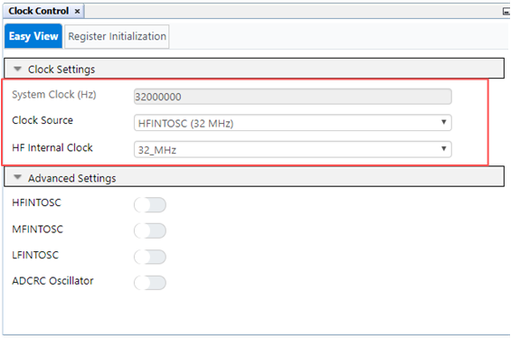
   Figure 19. Clock Module Window 

### Configuration Bits:

- Default Value for COSC bits: HFINTOSC (32 MHz)

  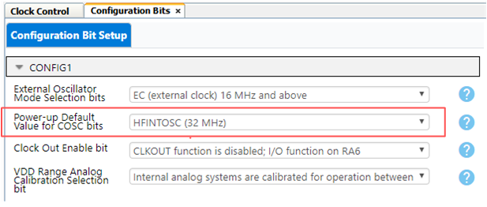
   Figure 20. Configuration Bits Window 

### EUSART:
- Baud Rate: 9600

  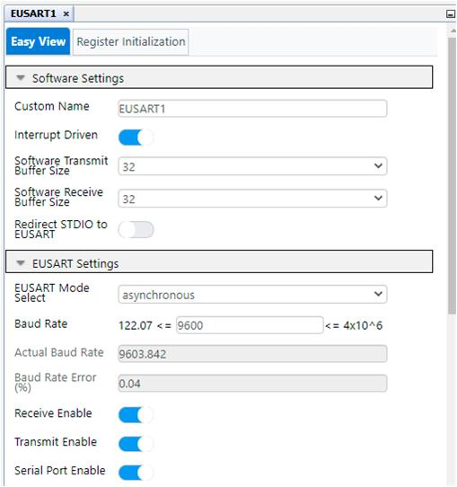
   Figure 21. EUSART Configuration Window 

### TMR0:
- Clock Prescaler: 1:8192
- Post scaler: 1:15
- Clock Source: HFINTOSC
- Requested Period(s): 0.98 (1s)

  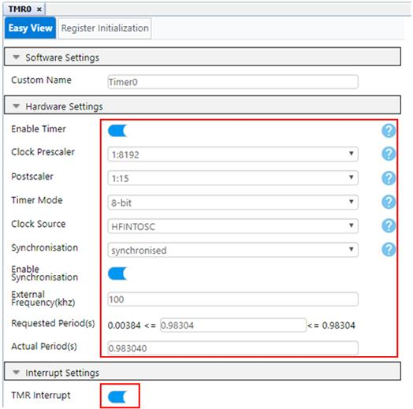
   Figure 22. TMR0 Configuration Window 

### Pin Grid View

  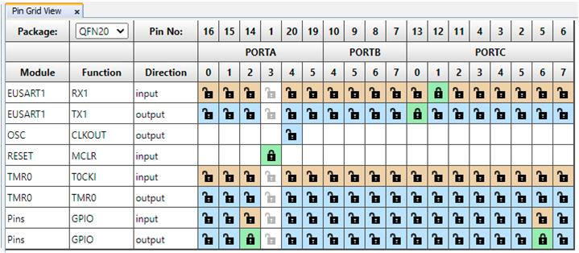
   Figure 23. Pin Grid View Window 

### Pins

.
  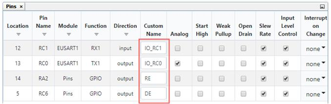
   Figure 24. Pins Window 

